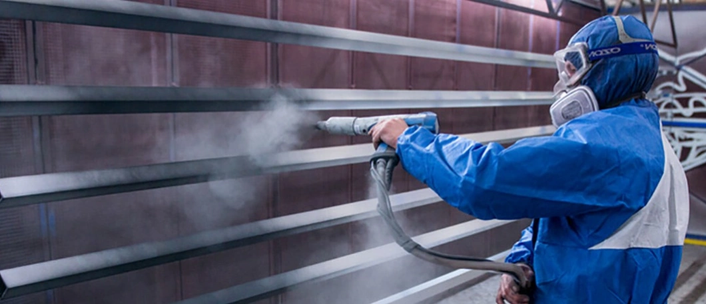

# Порошковое покрытие металлических изделий

Порошковая окраска выгодно отличается от окраски жидкими красками за счет более высоких декоративных и эксплуатационных свойств, приобретаемых изделиями после окрашивания.

* Высокая укрывистость краски позволяет окрашивать продукцию без предварительного грунтования и наносить ее тонким слоем, в отличие от жидких красок. Это важно при покраске декоративных элементов, стыковочных мест, резьбовых соединений и т.п.
* Более продолжительный срок эксплуатации окрашенных изделий в сравнении с жидкими красками, за счет хорошей адгезии (сцепление частиц краски с поверхностью - 500 кг/нм)
* Равномерность нанесенного покрытия. Отсутствуют растекания, «комки», подтеки и т.п.
* Широкий выбор цветов и разнообразные специальные эффекты, позволяют реализовать самые смелые дизайнерские решения
* Устойчивость к внешним механическим воздействиям: на удар 100 кг/м, на изгиб 4-6 мм
* Устойчивость к негативным воздействиям окружающей среды: перепады температур, ультрафиолет, коррозия и пр.
* Стойкость к воздействию химических веществ и соединений: кислоты, щелочи, органические растворители и пр.
* Пожаро- и взрывобезопасность, что обуславливает их широкое применение при окрашивании лифтов, дверей и т.п.
* Возможность выполнять работы быстрее, экономичнее и без ущерба качеству продукции. Это происходит за счет повторного использования (рекуперации) краски и меньшей трудоемкости процесса подготовки и окрашивания изделий.